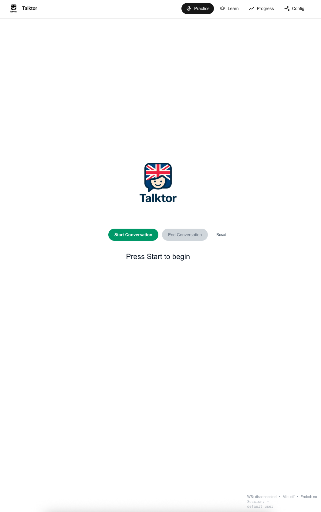
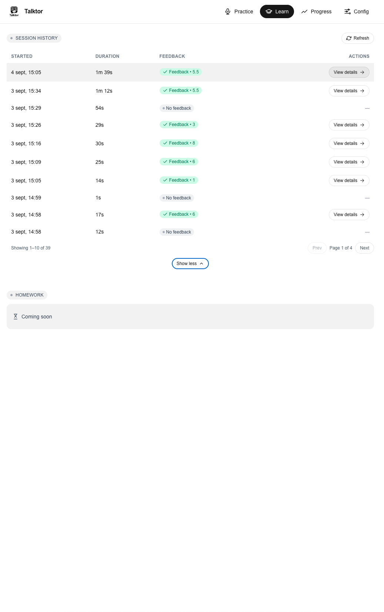
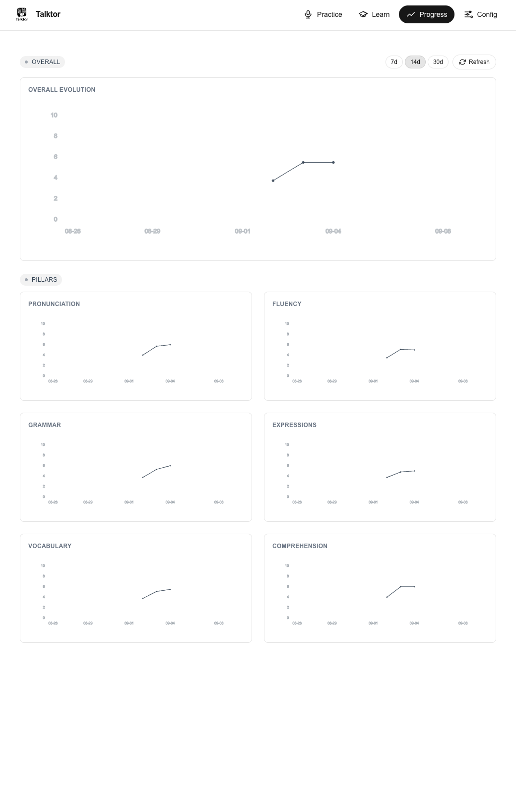
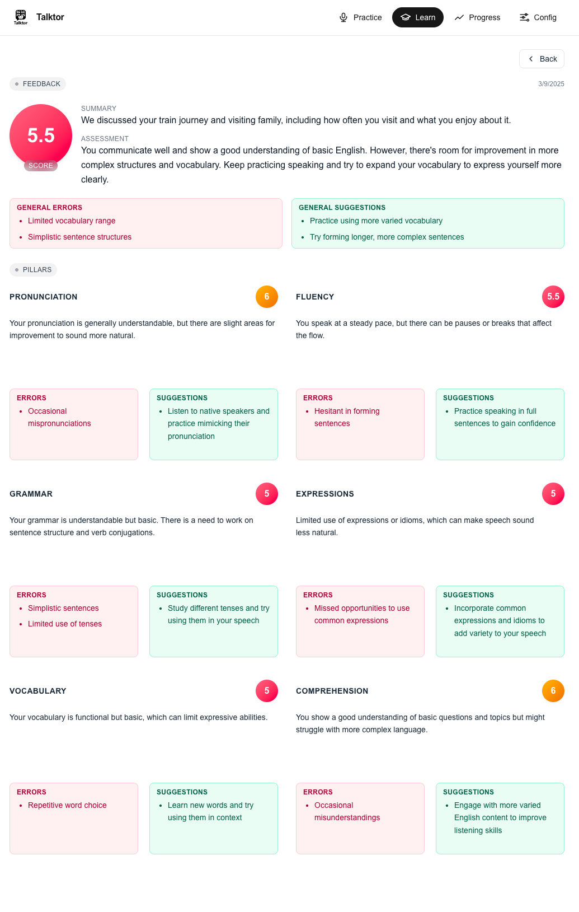

# Talktor v0.1 (MVP)

<p align="center">
  
</p>

Personal English-tutoring assistant for 5–10 minute practice conversations with an AI tutor. The MVP provides realtime (WebSocket) or text conversation, structured feedback (scores across 6 pillars), persistence (sessions, transcripts, feedback), and a minimal Next.js frontend.

- Backend: Python + FastAPI + PostgreSQL + SQLAlchemy
- AI: OpenAI (Realtime, GPT‑4o for analysis)
- Frontend: Next.js (App Router, TypeScript, Tailwind)
- Containers: Docker + docker‑compose

This README is scoped to v0.1 MVP and intentionally keeps security/testing light for speed of delivery.


## Repository Structure

Key paths (see `docs/CONTEXT_REPOSITORY.md` for full details):

```
.
├── backend/                     # FastAPI app, services, agents, DB models
│   ├── api/v1/                  # REST + WebSocket endpoints
│   ├── agents/                  # RealtimeAgent, StandardAgent
│   ├── core/                    # config, logging
│   ├── db/                      # models, database, crud
│   ├── services/                # openai_service, persistence_service, etc.
│   ├── main.py                  # FastAPI entrypoint
│   ├── requirements.txt         # Python deps
│   └── Dockerfile               # Backend container
├── frontend/                    # Next.js app
│   ├── src/                     # App router pages & components
│   └── Dockerfile               # Frontend container
├── scripts/
│   ├── ops/                     # Start/stop dev/prod
│   │   ├── dev_start.sh
│   │   ├── dev_stop.sh
│   │   ├── prod_start.sh
│   │   └── prod_stop.sh
│   ├── dev/
│   │   ├── view_logs.py         # Logs viewer
│   │   └── demo_logging.py      # Logging demo
│   └── interactive_audio_ws_client.py   # Realtime mic client
├── docs/                        # PRD, Architecture, API, Frontend, Context
├── docker-compose.yml           # Prod stack (backend + frontend + db + pgAdmin)
├── docker-compose.dev.yml       # Dev stack (db + pgAdmin + optional frontend)
├── .env.example                 # Example env vars
└── logs/                        # Runtime logs (created by backend)
```


## Prerequisites

- macOS with Docker Desktop installed and running
- Python 3.12 (for local backend dev)
- Node 22 (if running frontend outside Docker)
- OpenAI API key (required for AI features)


## Quickstart (Development)

The dev workflow runs the database in Docker and the backend locally in a Python virtualenv. Frontend can be started automatically in a container (optional).

1) Create and activate virtualenv, install dependencies

```bash
python3 -m venv .venv
source .venv/bin/activate
pip install -r backend/requirements.txt
```

2) Create your `.env`

```bash
cp .env.example .env
# Edit .env and set OPENAI_API_KEY, PostgreSQL and pgAdmin vars
```

3) Start the dev environment

```bash
./scripts/ops/dev_start.sh
```

What it does:

- Starts Postgres + pgAdmin via `docker-compose.dev.yml`
- Exports `POSTGRES_HOST=localhost` for the local backend
- Launches FastAPI with `uvicorn` on http://localhost:8000
- If port 3000 is free, starts a Next.js dev container at http://localhost:3000

Stop services:

```bash
./scripts/ops/dev_stop.sh
```

Manual backend run (alternative):

```bash
# from repo root with .venv activated
cd backend
uvicorn main:app --reload --host 0.0.0.0 --port 8000
```


## Quickstart (Production on localhost)

Run everything in Docker (backend, frontend, db, pgAdmin):

```bash
./scripts/ops/prod_start.sh
# Open: API http://localhost:8000, Docs http://localhost:8000/docs,
# Frontend http://localhost:3000, pgAdmin http://localhost:5050
```

Stop services (optionally purge volumes):

```bash
./scripts/ops/prod_stop.sh        # normal stop
./scripts/ops/prod_stop.sh --purge # stop and remove volumes
```


## Environment Variables

See `.env.example` for a minimal set:

```env
# PostgreSQL
POSTGRES_USER=postgres
POSTGRES_PASSWORD=postgres
POSTGRES_DB=talktor

# pgAdmin
PGADMIN_DEFAULT_EMAIL=admin@local.test
PGADMIN_DEFAULT_PASSWORD=admin

# OpenAI (required for AI features)
OPENAI_API_KEY=your_openai_api_key_here
```

Notes:

- In `docker-compose.yml` the backend uses `POSTGRES_HOST=db` (container network). In dev, `dev_start.sh` exports `POSTGRES_HOST=localhost` for the local backend process.
- Frontend reads `NEXT_PUBLIC_API_BASE_URL` (defaults to `http://localhost:8000`). The prod Dockerfile injects this at build time.


## API Overview

- Base URL (dev): `http://localhost:8000`
- Version prefix: `/api/v1`
- Auth (dev): none; REST endpoints accept `X-User-Id` (defaults to `default_user` if missing)

Key resources (see `docs/API.md` for schemas and examples):

- Conversations
  - `POST /api/v1/conversations/start`
  - `WS   /api/v1/conversations/{session_id}/realtime`
  - `POST /api/v1/conversations/{session_id}/end`
  - `GET  /api/v1/conversations/{session_id}`
  - `GET  /api/v1/conversations/{session_id}/transcripts`
- Feedback
  - `GET  /api/v1/feedback/{session_id}`
  - `GET  /api/v1/feedback/{session_id}/summary`
  - `POST /api/v1/feedback/{session_id}/generate` (placeholder in v0.1)
- Users
  - `GET  /api/v1/users/{user_id}/sessions`
  - `GET  /api/v1/users/{user_id}/progress`
  - `GET  /api/v1/users/{user_id}/stats`


## Realtime (WebSocket) – Voice or Text

Endpoint: `ws://localhost:8000/api/v1/conversations/{session_id}/realtime`

- Client → Server
  - Send raw binary audio frames (PCM16 24kHz mono), then `{ "type": "audio_commit" }` to transcribe/respond
  - Or send JSON text: `{ "type": "input_text", "text": "Hello" }`
  - End: `{ "type": "end" }` or plain "end"/"stop"/"finish"
- Server → Client
  - Streams AI audio as binary PCM16 frames
  - Emits transcript deltas/completions for user and AI
  - Sends `playback.clear` for barge‑in and `ended` on finalization

Explicit feedback request flow:

- When an end command or end phrase is detected, the server explicitly requests feedback upstream, waits briefly, then finalizes and persists the session + feedback.

Example interactive client (microphone streaming):

```bash
# Requires PyAudio; on macOS you may need: brew install portaudio
python scripts/interactive_audio_ws_client.py --user-id you --base-url http://127.0.0.1:8000
# Commands during session: /commit, /end, /mute, /unmute, /help
```


## Frontend (Next.js)

- Dev container can be started by the dev script if port 3000 is free (see `docker-compose.dev.yml`).
- To run locally without Docker:

```bash
cd frontend
npm ci
echo "NEXT_PUBLIC_API_BASE_URL=http://localhost:8000" > .env.local
npm run dev
# open http://localhost:3000
```

Pages (see `docs/FRONTEND.md`): Practice (realtime), Learn (sessions + feedback), Progress (charts), Config (local user settings).


## Application Screenshots

<div align="center">


<br/>
<em>Practice: Realtime conversation view</em>
<br/><br/>


<br/>
<em>Learn: Sessions list and feedback summary</em>
<br/><br/>


<br/>
<em>Progress: Pillar trends and overall evolution</em>
<br/><br/>


<br/>
<em>Feedback Details: Full structured feedback (general + pillars)</em>

</div>

## Logging

Structured logging writes to console and `logs/` with timestamped files. Utilities:

```bash
python scripts/dev/view_logs.py --tail 50
python scripts/dev/view_logs.py --list
python scripts/dev/view_logs.py --search "error"
python scripts/dev/view_logs.py --follow

# Demo
python scripts/dev/demo_logging.py
```


## Data & Persistence (MVP)

- One session row per conversation, one transcript collection, and one comprehensive feedback row per session.
- Feedback includes overall score, general summary/feedback, and 6 pillars (pronunciation, fluency, grammar, expressions, vocabulary, comprehension) with scores, summaries, errors, and suggestions.

See `docs/CONTEXT_REPOSITORY.md` for table summaries.


## Known Limitations (v0.1)

- Minimal auth (dev header `X-User-Id` only). No multi‑tenant or RBAC.
- `POST /api/v1/feedback/{session_id}/generate` is a placeholder; feedback is generated automatically in the realtime flow when ending.
- CORS is permissive for development.
- Basic error handling; comprehensive test coverage pending.
- Realtime client is a developer tool and may require system audio dependencies.


## Troubleshooting

- Backend health: `curl -sf http://localhost:8000/health`
- Docker not ready: re-run `dev_start.sh` or `prod_start.sh` (scripts auto-wait for Docker Desktop)
- OpenAI disabled: set `OPENAI_API_KEY` in `.env` (backend side)
- DB connection errors: ensure Postgres is up (check `docker ps`) and env vars match
- WebSocket drops: tail backend logs with `scripts/dev/view_logs.py --tail 100 --follow`


## Documentation

- API reference: `docs/API.md`
- Backend architecture: `docs/ARCHITECTURE.md`
- Frontend overview: `docs/FRONTEND.md`
- Repository context: `docs/CONTEXT_REPOSITORY.md`
- Product requirements (PRD): `docs/PRD.md`


## License

See `LICENSE`.